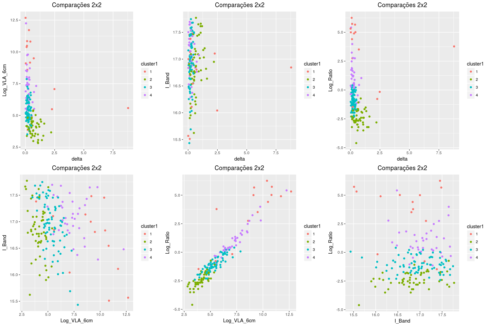
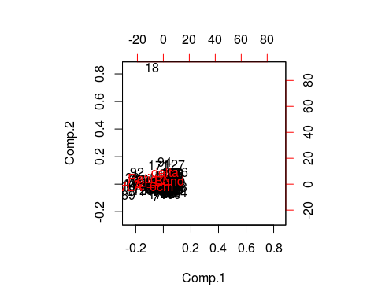
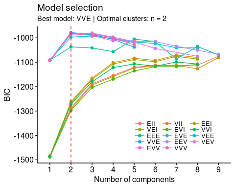

# Análise com os dados 'Kell_table.txt'

<!-- <style> -->
<!-- body { -->
<!-- text-align: justify} -->
<!-- </style> -->


### Breve Resumo
Neste arquivo constam os resultados da análise com os dados de "Kell.txt". A seguir, está a descrição geral dos procedimentos:

* utilizou-se apenas o algoritmo de agrupamento (EM - GMM) do pacote MClust;
* os algoritmos foram rodados considerando todas as variaveis inicialmente;
* realizou-se análise de componentes principais;
* confeccionou-se um GIF parar verificar como os dados estariam separados nas respectivas dimensões;
* por fim, repetiu-se o algoritmo de agrupamento apenas para as variáveis Log_VLA_6cm e Log_Ratio.


### Resultados

```r
load("~/WKSPCE_analise2_kell.RData")
```

Primeiramente plotamos os pares de variáveis. Destaca-se o segundo gráfico Core vs B_Band, com o aspecto de duas diagonais bem definidas segundo o valor do $R$.


```r
#leitura
# kell.loc<-file.choose()
# kell.df <- read.table(kell.loc, header=TRUE)

# eliminando a coluna de REDSHIFT
kell.df <- kell.df[,-2]

# tirando as obs com zeros:
#kell.df[kell.df==0,]
kell.df <- kell.df[-which(kell.df$delta==0),]

# transformando as variaveis Ratio e VLA_6cm para log
library(tidyr)
kell.df[,c("VLA_6cm", "Ratio")] <- log(kell.df[,c("VLA_6cm", "Ratio")])
colnames(kell.df)[c(2,4)] <- c("Log_VLA_6cm", "Log_Ratio")

#plotando
#install.packages("gridExtra")

library(ggplot2)
library(gridExtra)

comb = combn(ncol(kell.df[,1:4]),2)
p = list()

# para pegar e passar os nomes das variaveis corretamente para o ggplot
nomes <- colnames(kell.df)
comb_nomes <- matrix(NA, nrow=2, ncol=ncol(comb))

comb_nomes <- sapply(1:ncol(comb),function(j){
  sapply(1:2,function(i){
    comb_nomes[i,j]<-nomes[comb[i,j]]
  })
})

p <- sapply(1:length(comb), function(i){
  apply(comb_nomes, 2, function(x){
    p[i] <- ggplot(kell.df, aes_string(x[1], x[2]))+
      geom_point(size = 1.5)+
      ggtitle("Comparações 2x2")+
      theme(plot.title = element_text(hjust=0.5))
  })  
})

#x11()
grid.arrange(p[[1]],p[[2]],p[[3]],p[[4]],p[[5]],p[[6]], ncol=3)
```

<!-- -->


Em seguida, rodamos o GMM do pacote MClust para todas as 5 variáveis dos dados kell (delta, REDSHIFT, VLA_6cm, I_Band, Ratio) sem restrição quanto ao número de grupos. O modelo ideal seria o com $3$ grupos, conforme se verifica da tabela e do gráfico de BIC's.


```r
#rodando MClust

### G irrestrito
library(mclust)
library(factoextra)

out1 <- Mclust(kell.df[,1:4])
#str(out1)
summary(out1$BIC)
```

```
## Best BIC values:
##              VVV,4      VVV,5      VVE,7
## BIC      -358.5032 -374.80392 -382.63467
## BIC diff    0.0000  -16.30068  -24.13143
```

```r
fviz_mclust_bic(out1)
```

<!-- -->

```r
# levando a classificação para os dados originais
kell.df$cluster1 <- as.factor(out1$classification)

p <- sapply(1:length(comb), function(i){
  apply(comb_nomes, 2, function(x){
    p[i] <- ggplot(kell.df, aes_string(x[1], x[2]))+
      geom_point(aes(colour = cluster1),size = 1.5)+
      ggtitle("Comparações 2x2")+
      theme(plot.title = element_text(hjust=0.5))
  })  
})

grid.arrange(p[[1]],p[[2]],p[[3]],p[[4]],p[[5]],p[[6]], ncol=3)
```

<!-- -->

```r
#fviz_mclust(out1, "classification", geom = "point")
```

O próximo passo consistiu em rodar o GMM fixado em 2 grupos. As classificações são aprensentadas abaixo para cada par de variáveis.


```r
### G=2

out2 <- Mclust(kell.df[,1:4], G=2)
#str(out2)
#summary(out2$BIC)
#fviz_mclust_bic(out2)

# levando a classificação para os dados originais
kell.df$cluster2 <- as.factor(out2$classification)

p <- sapply(1:length(comb), function(i){
  apply(comb_nomes, 2, function(x){
    p[i] <- ggplot(kell.df, aes_string(x[1], x[2]))+
      geom_point(aes(colour = cluster2),size = 1.5)+
      ggtitle("Comparações 2x2")+
      theme(plot.title = element_text(hjust=0.5))
  })  
})

grid.arrange(p[[1]],p[[2]],p[[3]],p[[4]],p[[5]],p[[6]], ncol=3)
```

<!-- -->

```r
#fviz_mclust(out1, "classification", geom = "point")
```

Na Análise de Componentes Principais nota-se o peso considerável da primeira componente na explicação da variabilidade dos dados. Isto, aliado aos aos coeficientes das variaveis originais nas componentes principais, apontam que log_VLA_6cm e log_Ratio seriam as variáveis mais importantes para se explicar a variabilidade dos dados. Este resultado é corroborado pelo padrão (denso) do scatter plot dessas duas variáveis nos gráficos 2x2. Chama atenção um outlier na componente 2, provocado pela variável delta, como será verificado na imagem GIF posteriormente. Esse outlier refere-se ao objeto 18.


```r
#PCA:
pca<-princomp(kell.df[,1:4])
summary(pca)
```

```
## Importance of components:
##                           Comp.1     Comp.2     Comp.3      Comp.4
## Standard deviation     2.7519173 0.78993212 0.57481298 0.193088903
## Proportion of Variance 0.8842129 0.07285605 0.03857795 0.004353121
## Cumulative Proportion  0.8842129 0.95706892 0.99564688 1.000000000
```

```r
pca$loadings
```

```
## 
## Loadings:
##             Comp.1 Comp.2 Comp.3 Comp.4
## delta               0.904 -0.359 -0.232
## Log_VLA_6cm -0.675 -0.273 -0.361 -0.583
## I_Band              0.163  0.792 -0.588
## Log_Ratio   -0.737  0.287  0.336  0.511
## 
##                Comp.1 Comp.2 Comp.3 Comp.4
## SS loadings      1.00   1.00   1.00   1.00
## Proportion Var   0.25   0.25   0.25   0.25
## Cumulative Var   0.25   0.50   0.75   1.00
```

```r
# log_VLA e Ratio são os mais importantes para explicar a variabilidade dos dados

#install.packages("ggfortify")
#http://rpubs.com/sinhrks/plot_pca

library(ggfortify)
autoplot(pca)
```

<!-- -->

```r
# verificando quem eh o outlier:
biplot(pca)
```

<!-- -->

```r
# o objeto 18 aprece como um outlier
```


Essa separação verificada na PCA pode ser melhor notada no GIF abaixo confeccionado com o pacote $tourr$:


```r
#tourr
library(tourr)

animate(kell.df[,1:5],
        grand_tour(d = 2), display = display_xy())
```


Na última etapa, buscou-se testar o GMM utilizando apenas duas variáveis dos dados. Optou-se pelas duas variaveis que apresentaram um padrão diagonal de dispersão dos dados nos plots 2x2, quais sejam: Log_VLA_6cm e Log_Ratio. Dado seu agrupamento denso, são as mais importantes para explicar a variabilidade total dos dados, conforme se verificou nos resultados da PCA.  

Tanto com o número de clusters irrestrito quanto para G=2 o resultado do agrupamento fora praticamente o mesmo.

Sem estabelecer G, o número de clusters ideal via BIC retornado foi 2.

Em uma analogia aos resultados obtidos com os dados Sikora (perdoem-me caso não faça sentido essa comparação em termos físicos), a única separação obtida foi aquela diametralmente oposta: objetos agrupados no canto inferior esquerdo vs objetos no canto superior direito. Cabe ressaltar, no entanto, a diferença na densidade de pontos entre os grupos.


```r
### G irrestrito (I_BAND vs REDSHIFT)
out3 <- Mclust(kell.df[,c("Log_VLA_6cm", "Log_Ratio")])
#str(out3)
summary(out3$BIC)
```

```
## Best BIC values:
##              VVE,2       EEV,3       VEV,3
## BIC      -978.1247 -980.712790 -980.910801
## BIC diff    0.0000   -2.588077   -2.786087
```

```r
fviz_mclust_bic(out3)
```

<!-- -->

```r
# levando a classificação para os dados originais
kell.df$cluster3 <- as.factor(out3$classification)

p <- ggplot(kell.df, aes(Log_VLA_6cm, Log_Ratio))+
      geom_point(aes(colour = cluster3),size = 1.5)+
      ggtitle("Teste Clustering Específico para 2 var")+
      theme(plot.title = element_text(hjust=0.5));p
```

<!-- -->


Estabelecendo G=2, obtve-se praticamente o mesmo resultado.

```r
### G=2 (Log_VLA_6cm vs Log_Ratio)

out4 <- Mclust(kell.df[,c("Log_VLA_6cm", "Log_Ratio")], G=2)
#str(out4)
#summary(out4$BIC)
#fviz_mclust_bic(out2)

# levando a classificação para os dados originais
kell.df$cluster4 <- as.factor(out4$classification)

p <- ggplot(kell.df, aes(Log_VLA_6cm, Log_Ratio))+
  geom_point(aes(colour = cluster4),size = 1.5)+
  ggtitle("Teste Clustering Específico para 2 var")+
  theme(plot.title = element_text(hjust=0.5));p
```

<!-- -->

Portanto, em termos de agrupamento, os dados "Kell_table.txt" não demonstram qualquer resultado que chame muita atenção. Quanto aos resultados da PCA, dos demais gráficos e do GIF (tourr), verificou-se que  LogVLA_6cm e Log_Ratio são as variáveis mais importantes para explicar a variabilidade total dos dados. A análise específica dessas duas variáveis, sujeitando-as ao GMM, não apresentou, contudo, qualquer evidência de separação diagonal. 
