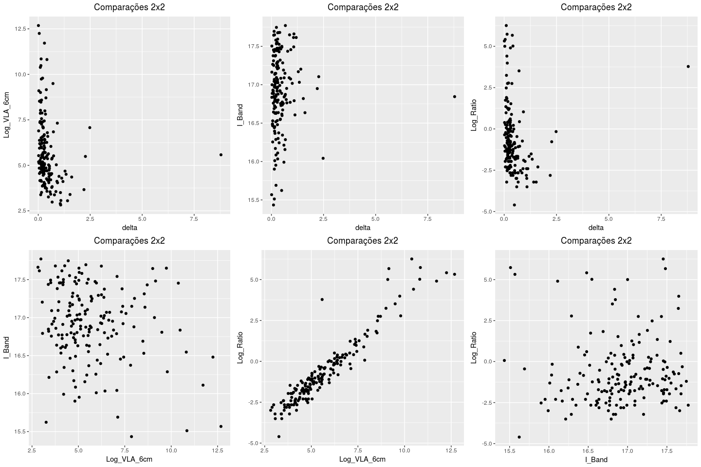
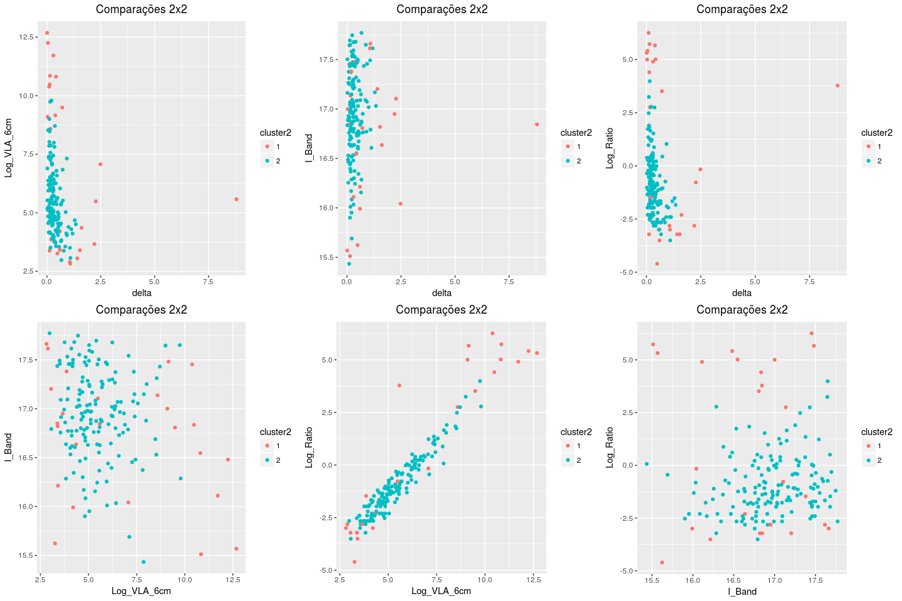

# Análise com os dados 'Kell_table.txt'

<!-- <style> -->
<!-- body { -->
<!-- text-align: justify} -->
<!-- </style> -->


### Breve Resumo
Neste arquivo constam os resultados da análise com os dados de "Kell.txt". A seguir, está a descrição dos procedimentos:

* utilizou-se apenas o algoritmo de agrupamento (EM - GMM) do pacote MClust;
* os algoritmos foram rodados considerando todas as variaveis inicialmente;
* confeccionou-se um GIF parar verificar como os dados estariam separados nas respectivas dimensões;
* realizou-se análise de componentes principais;
* por fim, repetiu-se o algoritmo de agrupamento apenas para as variáveis REDSHIFT e I_Band.


### Resultados

```r
load("~/WKSPCE_analise2_kell.RData")
```

Primeiramente plotamos os pares de variáveis. Destaca-se o segundo gráfico Core vs B_Band, com o aspecto de duas diagonais bem definidas segundo o valor do $R$.


```r
#leitura
# kell.loc<-file.choose()
# kell.df <- read.table(kell.loc, header=TRUE)

#plotando
#install.packages("gridExtra")

library(ggplot2)
library(gridExtra)

comb = combn(5,2)
p = list()
#i = 1

#x = comb[,1]
# para pegar e passar os nomes das variaveis corretamente para o ggplot
nomes <- colnames(kell.df)

comb_nomes <- matrix(NA, nrow=2, ncol=ncol(comb))
comb_nomes <- sapply(1:ncol(comb),function(j){
  sapply(1:2,function(i){
    comb_nomes[i,j]<-nomes[comb[i,j]]
  })
})

p <- sapply(1:length(comb), function(i){
  apply(comb_nomes, 2, function(x){
    p[i] <- ggplot(kell.df, aes_string(x[1], x[2]))+
      geom_point(size = 1.5)+
      ggtitle("Comparações 2x2")+
      theme(plot.title = element_text(hjust=0.5))
  })  
})

#x11()
grid.arrange(p[[1]],p[[2]],p[[3]],p[[4]],p[[5]],p[[6]],p[[7]],p[[8]],
             p[[9]],p[[10]], ncol=5)
```

<!-- -->

```r
#p[[1]]; p[[2]]
```


Em seguida, rodamos o GMM do pacote MClust para todas as 5 variáveis dos dados kell (delta, REDSHIFT, VLA_6cm, I_Band, Ratio) sem restrição quanto ao número de grupos. O modelo ideal seria o com $3$ grupos, conforme se verifica da tabela e do gráfico de BIC's.


```r
#rodando MClust

### G irrestrito
library(mclust)
library(factoextra)

out1 <- Mclust(kell.df)
#str(out1)
summary(out1$BIC)
```

```
## Best BIC values:
##              VVE,3       VVI,3       VVI,4
## BIC      -3103.549 -3152.26710 -3156.92303
## BIC diff     0.000   -48.71765   -53.37358
```

```r
fviz_mclust_bic(out1)
```

<!-- -->

```r
# levando a classificação para os dados originais
kell.df$cluster1 <- as.factor(out1$classification)

p <- sapply(1:length(comb), function(i){
  apply(comb_nomes, 2, function(x){
    p[i] <- ggplot(kell.df, aes_string(x[1], x[2]))+
      geom_point(aes(colour = cluster1),size = 1.5)+
      ggtitle("Comparações 2x2")+
      theme(plot.title = element_text(hjust=0.5))
  })  
})

grid.arrange(p[[1]],p[[2]],p[[3]],p[[4]],p[[5]],p[[6]],p[[7]],p[[8]],
             p[[9]],p[[10]], ncol=5)
```

<!-- -->

```r
#fviz_mclust(out1, "classification", geom = "point")
```

O próximo passo consistiu em rodar o GMM fixado em 2 grupos. As classificações são aprensentadas abaixo para cada par de variáveis. Não há qualquer evidência de clusters diagonais.


```r
### G=2

out2 <- Mclust(kell.df[,1:5], G=2)
#str(out2)
#summary(out2$BIC)
#fviz_mclust_bic(out2)

# levando a classificação para os dados originais
kell.df$cluster2 <- as.factor(out2$classification)

p <- sapply(1:length(comb), function(i){
  apply(comb_nomes, 2, function(x){
    p[i] <- ggplot(kell.df, aes_string(x[1], x[2]))+
      geom_point(aes(colour = cluster2),size = 1.5)+
      ggtitle("Comparações 2x2")+
      theme(plot.title = element_text(hjust=0.5))
  })  
})

grid.arrange(p[[1]],p[[2]],p[[3]],p[[4]],p[[5]],p[[6]],p[[7]],p[[8]],
             p[[9]],p[[10]], ncol=5)
```

<!-- -->

```r
#fviz_mclust(out1, "classification", geom = "point")
```

Na Análise de Componentes Principais nota-se o peso próximo de 1 da primeira componente na explicação da variabilidade dos dados.


```r
#PCA:
pca<-princomp(kell.df[,1:5])
summary(pca)
```

```
## Importance of components:
##                              Comp.1       Comp.2       Comp.3       Comp.4
## Standard deviation     3.050594e+04 5.171852e+01 7.416579e-01 4.849487e-01
## Proportion of Variance 9.999971e-01 2.874234e-06 5.910678e-10 2.527096e-10
## Cumulative Proportion  9.999971e-01 1.000000e+00 1.000000e+00 1.000000e+00
##                              Comp.5
## Standard deviation     2.358443e-02
## Proportion of Variance 5.976968e-13
## Cumulative Proportion  1.000000e+00
```

```r
#install.packages("ggfortify")
#http://rpubs.com/sinhrks/plot_pca

library(ggfortify)
autoplot(pca)
```

<!-- -->


Essa separação verificada na PCA pode ser melhor notada no GIF abaixo confeccionado com o pacote $tourr$:


```r
#tourr
library(tourr)

animate(kell.df[,1:5],
        grand_tour(d = 2), display = display_xy())
```


Na última etapa, buscou-se o teste de agrupamento utilizando apenas duas variáveis. Nos pareceu que o gráfico I_Band vs Redshift seria o que tem o formato mais próximo com a diagonal que se desejava testar no caso Sikora. Tanto com o número de clusters irrestrito quanto para G=2 no MClust não houve qualquer evidência para uma forma diagonal de agrupamento.

Sem estabelecer G, o número de clusters ideal via BIC retornado foi 4.


```r
### G irrestrito (I_BAND vs REDSHIFT)
out3 <- Mclust(kell.df[,c("REDSHIFT", "I_Band")])
#str(out3)
summary(out3$BIC)
```

```
## Best BIC values:
##             VEE,4     VEE,5      EEE,3
## BIC      589.9329 582.43821 580.442317
## BIC diff   0.0000  -7.49466  -9.490553
```

```r
fviz_mclust_bic(out3)
```

<!-- -->

```r
# levando a classificação para os dados originais
kell.df$cluster3 <- as.factor(out3$classification)

p <- ggplot(kell.df, aes(REDSHIFT, I_Band))+
      geom_point(aes(colour = cluster3),size = 1.5)+
      ggtitle("Teste Clustering Específico para 2 var")+
      theme(plot.title = element_text(hjust=0.5));p
```

<!-- -->


Estabelecendo G=2, obtivemos o seguinte resultado.

```r
### G=2 (I_BAND vs REDSHIFT)

out4 <- Mclust(kell.df[,c("REDSHIFT", "I_Band")], G=2)
#str(out4)
#summary(out4$BIC)
#fviz_mclust_bic(out2)

# levando a classificação para os dados originais
kell.df$cluster4 <- as.factor(out4$classification)

p <- ggplot(kell.df, aes(REDSHIFT, I_Band))+
  geom_point(aes(colour = cluster4),size = 1.5)+
  ggtitle("Teste Clustering Específico para 2 var")+
  theme(plot.title = element_text(hjust=0.5));p
```

<!-- -->

Portanto, verifica-se que nos dados "Kell_table.txt" também não há qualquer indicação da separação diagonal de clusters. Os resultados da PCA, dos demais gráficos e do GIF (tourr) mostram dois grupos bem separados com relação a variável REDSHIFT.
