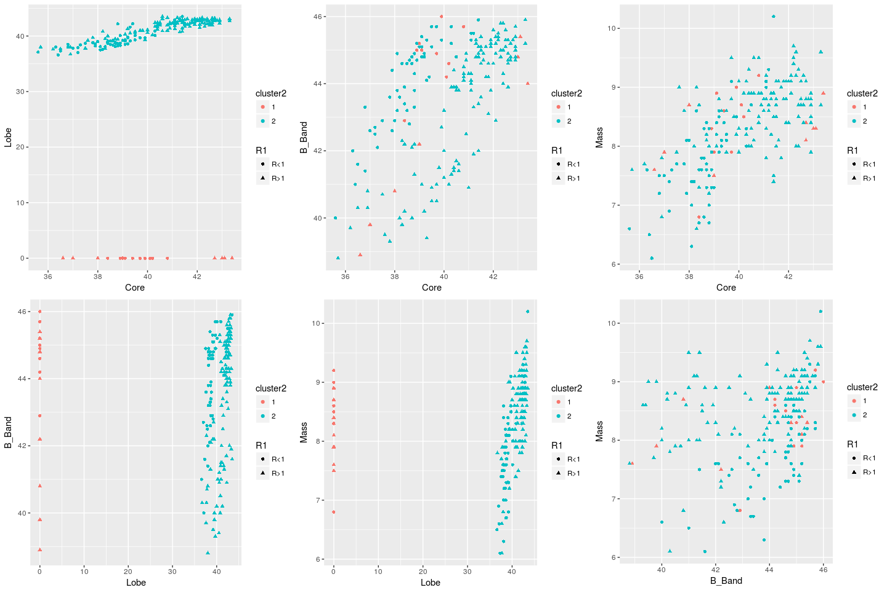

# 2ª Análise com os dados 'Sikora_Complete.txt'

<!-- <style> -->
<!-- body { -->
<!-- text-align: justify} -->
<!-- </style> -->


### Breve Resumo
Neste arquivo constam os resultados da segunda análise com os dados de "Sikora_complete.txt". A seguir, está a descrição dos procedimentos:

* utilizou-se apenas o algoritmo de agrupamento (EM - GMM) do pacote MClust;
* nos plots, fora empregada a caracterização de $R \ge 1$ ou $<1$;
* os algoritmos foram rodados considerando todas as variaveis inicialmente;
* confeccionou-se um GIF parar verificar como os dados estariam separados nas respectivas dimensões;
* realizou-se análise de componentes principais;
* por fim, repetiu-se o algoritmo de agrupamento apenas para as variáveis Core e B_Band, considerando a característica de $R \ge 1$ ou $<1$.


### Resultados

```r
load("~/WKSPCE_analise2_sikora.RData")
```

Primeiramente plotamos os pares de variáveis com a caracterização relativa a $R \ge 1$ ou $<1$ para as observações. Destaca-se o segundo gráfico Core vs B_Band, com o aspecto de duas diagonais bem definidas segundo o valor do $R$.


```r
#leitura
# sikora.loc <- file.choose()
# sikora.df <- read.table(sikora.loc, header=TRUE)
#str(sikora.df)

# criando fator
sikora.df$R1 <- (sikora.df$R >= 1)
sikora.df$R1 <- ifelse(sikora.df$R1 == TRUE, "R>1", "R<1")


#plotando
#install.packages("gridExtra")

library(ggplot2)
library(gridExtra)

comb = combn(4,2)
p = list()
#i = 1

#x = comb[,1]
# para pegar e passar os nomes das variaveis corretamente para o ggplot
nomes <- colnames(sikora.df[1:4])

comb_nomes <- matrix(NA, nrow=2, ncol=ncol(comb))
comb_nomes <- sapply(1:ncol(comb),function(j){
  sapply(1:2,function(i){
    comb_nomes[i,j]<-nomes[comb[i,j]]
  })
})

p <- sapply(1:length(comb), function(i){
  apply(comb_nomes, 2, function(x){
    p[i] <- ggplot(sikora.df, aes_string(x[1], x[2]))+
      geom_point(aes(colour = R1), size = 1.5)+
      ggtitle("Comparação R>1 e R<1")+
      theme(plot.title = element_text(hjust=0.5))
  })  
})
#ok!

grid.arrange(p[[1]],p[[2]],p[[3]],p[[4]],p[[5]],p[[6]], ncol=3)
```

<!-- -->

```r
#p[[1]]; p[[2]]
```


Em seguida, rodamos o GMM do pacote MClust para as 4 variáveis (Core, Lobe, B_Band e Mass ) sem restrição quanto ao número de grupos. O modelo ideal seria o com $4$ grupos, conforme se verifica da tabela e do gráfico de BIC's.


```r
#rodando MClust

### G irrestrito
library(mclust)
library(factoextra)

out1 <- Mclust(sikora.df[,1:4])
#str(out1)
summary(out1$BIC)
```

```
## Best BIC values:
##              VEV,4       EEV,4       EEV,6
## BIC      -2269.529 -2284.99798 -2300.63019
## BIC diff     0.000   -15.46928   -31.10149
```

```r
fviz_mclust_bic(out1)
```

<!-- -->


Em seguida, recuperamos essa classificação para os pares de variáveis, ainda mantendo o shape diferenciado para o valor do $R$. 


```r
# levando a classificação para os dados originais
sikora.df$cluster1 <- as.factor(out1$classification)

p <- sapply(1:length(comb), function(i){
  apply(comb_nomes, 2, function(x){
    p[i] <- ggplot(sikora.df, aes_string(x[1], x[2]))+
      geom_point(aes(colour = cluster1, shape=R1), size = 1.5)+
      #ggtitle("Comparação R>1 e R<1")+
      theme(plot.title = element_text(hjust=0.5))
  })  
})

#x11()
grid.arrange(p[[1]],p[[2]],p[[3]],p[[4]],p[[5]],p[[6]], ncol=3)
```

<!-- -->

```r
#fviz_mclust(out1, "classification", geom = "point")
```

O próximo passo consistiu em rodar o GMM fixando em 2 grupos. As classificações são aprensentadas abaixo para cada par de variáveis. Ressalta-se não haver evidência dos clusters "diagonais" no caso Core vs B_Band assim como na primeira análise preliminar.


```r
### G=2

out2 <- Mclust(sikora.df[,1:4], G=2)
#str(out2)
#summary(out2$BIC)
#fviz_mclust_bic(out2)

# levando a classificação para os dados originais
sikora.df$cluster2 <- as.factor(out2$classification)

p <- sapply(1:length(comb), function(i){
  apply(comb_nomes, 2, function(x){
    p[i] <- ggplot(sikora.df, aes_string(x[1], x[2]))+
      geom_point(aes(colour = cluster2, shape=R1), size = 1.5)+
      #ggtitle("Comparação R>1 e R<1")+
      theme(plot.title = element_text(hjust=0.5))
  })  
})

#x11()
grid.arrange(p[[1]],p[[2]],p[[3]],p[[4]],p[[5]],p[[6]], ncol=3)
```

<!-- -->

```r
#fviz_mclust(out2, "classification", geom = "point")
```

Na Análise de Componentes Principais nota-se o grande peso da componente 1 na explicação da variabilidade dos dados.


```r
#PCA:
pca<-princomp(sikora.df[,1:4])
summary(pca)
```

```
## Importance of components:
##                            Comp.1    Comp.2      Comp.3     Comp.4
## Standard deviation     12.1941450 2.3367059 1.182165341 0.53013870
## Proportion of Variance  0.9541906 0.0350381 0.008967861 0.00180348
## Cumulative Proportion   0.9541906 0.9892287 0.998196520 1.00000000
```

```r
#install.packages("ggfortify")
#http://rpubs.com/sinhrks/plot_pca

library(ggfortify)
autoplot(pca)
```

<!-- -->


Essa separação verificada na PCA pode ser melhor notada no GIF abaixo confeccionado com o pacote $tourr$:


```r
#tourr
library(tourr)

animate(sikora.df[,1:4],
        grand_tour(d = 2), display = display_xy())
```


Na última etapa, buscou-se repetir o teste de agrupamento utilizando apenas duas variáveis. Tanto com o número de clusters irrestrito quanto para G=2 no MClust não se recuperou a forma diagonal dos clusters. Incluiu-se o shpae referente ao valor da variável $R$ nos gráficos.

Sem estabelecer G, o número de clusters ideal retornado foi 3.


```r
### G irrestrito (I_BAND vs REDSHIFT)

out3 <- Mclust(sikora.df[,c("Core", "B_Band")])
#str(out3)
summary(out3$BIC)
```

```
## Best BIC values:
##              VEE,3        VII,4       VEV,3
## BIC      -1411.435 -1414.357052 -1415.56716
## BIC diff     0.000    -2.922437    -4.13254
```

```r
#fviz_mclust_bic(out2)

# levando a classificação para os dados originais
sikora.df$cluster3 <- as.factor(out3$classification)

p <- ggplot(sikora.df, aes(Core, B_Band))+
  geom_point(aes(colour = cluster3, shape=R1),size = 1.5)+
  ggtitle("Teste Clustering Específico para 2 var")+
  theme(plot.title = element_text(hjust=0.5));p
```

<!-- -->


Estabelecendo G=2, obtivemos o seguinte resultado.

```r
### G=2 (Core vs B_Band)

out4 <- Mclust(sikora.df[,c("Core", "B_Band")], G=2)
#str(out4)
#summary(out4$BIC)
#fviz_mclust_bic(out2)

# levando a classificação para os dados originais
sikora.df$cluster4 <- as.factor(out4$classification)

p <- ggplot(sikora.df, aes(Core, B_Band))+
  geom_point(aes(colour = cluster4, shape=R1),size = 1.5)+
  ggtitle("Teste Clustering Específico para 2 var")+
  theme(plot.title = element_text(hjust=0.5));p
```

<!-- -->

Portanto, verifica-se que não há qualquer indicação da separação diagonal dos clusters. Contudo, os resultados da PCA, dos demais gráficos e do GIF (tourr) mostram dois grupos bem separados com relação a variável Lobe.
