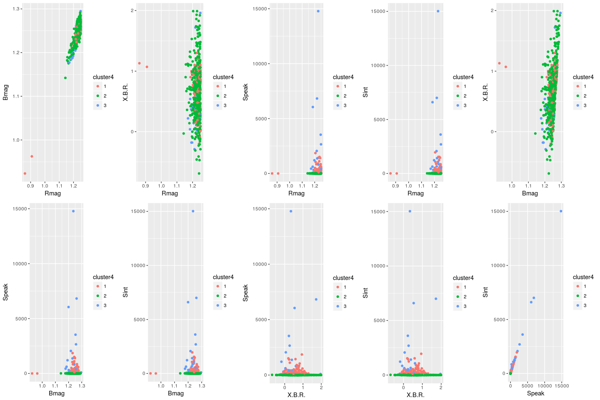

<!-- <style> -->
<!-- body { -->
<!-- text-align: justify} -->
<!-- </style> -->


### Breve Resumo
Neste arquivo constam os resultados da terceira análise dos dados sobre a dicotomia, desta vez realizando para os 4 data sets disponíveis:

* utilizou-se apenas o algoritmo de agrupamento (EM - GMM) do pacote MClust;
* nos plots (2 a 2), fora empregada a caracterização de $R \ge 1$ ou $<1$, quando aplicável;
* os algoritmos foram rodados considerando todas as variaveis em cada data-set;
* testou-se o GMM com grupos G=2, G=3 e G indefinido, a fim de verificar (via BIC) o quão diferente era o modelo com G=2 em relação ao(s) outro(s);


### Resultados


### Primeiro data-set: "Parameters_1_CBMRT.txt"

#### Análise fator R>1, R<1:

<!-- -->


#### GMM com G=2 grupos:


<!-- -->

```
## Best BIC values:
##              EEV,2        VVV,2       EVV,2
## BIC      -1008.626 -1014.420635 -1021.30798
## BIC diff     0.000    -5.795045   -12.68239
```


#### GMM com G=3 grupos:


<!-- -->

```
## Best BIC values:
##              EEV,3       VEV,3       VVV,3
## BIC      -974.4024 -975.738857 -981.557544
## BIC diff    0.0000   -1.336477   -7.155165
```


#### GMM com G irrestrito:

<!-- -->

```
## Best BIC values:
##              EEE,4        VEE,4       EEE,6
## BIC      -963.5201 -963.9065789 -965.891823
## BIC diff    0.0000   -0.3864888   -2.371733
```

<!-- -->


#### Conclusão dataset: "Parameters_1_CBMRT.txt"

* em todos os casos, o GMM não indicou separação dos grupos na diagonal;
* o modelo "ideal" de clusters, de acordo com a técnica BIC, seria o modelo com 4 agrupamentos;
* não há grande diferença, em termos de BIC, entre o modelo com 2 grupos e o modelo de 4 grupos.


### Segundo data-set: "Parameters_2_RBMRT.txt"

#### Análise fator R>1, R<1:

<!-- -->


#### GMM com G=2 grupos:


<!-- -->

```
## Best BIC values:
##              VVV,2        VVE,2       EEE,2
## BIC      -1108.877 -1112.715148 -1124.86463
## BIC diff     0.000    -3.838275   -15.98775
```


#### GMM com G=3 grupos:

<!-- -->

```
## Best BIC values:
##              EEE,4        VEE,4       EEE,6
## BIC      -963.5201 -963.9065789 -965.891823
## BIC diff    0.0000   -0.3864888   -2.371733
```


#### GMM com G irrestrito:

<!-- -->

```
## Best BIC values:
##              VEE,4        VEE,6       VEE,5
## BIC      -1043.548 -1053.357192 -1056.00300
## BIC diff     0.000    -9.809422   -12.45523
```

<!-- -->


#### Conclusão dataset: "Parameters_2_RBMRT.txt"

* em todos os casos, o GMM não indicou separação dos grupos na diagonal;
* o modelo "ideal" de clusters, de acordo com a técnica BIC, seria o modelo com 4 agrupamentos;
* não há grande diferença, em termos de BIC, entre o modelo com 2 grupos e 4 grupos.


### Terceiro data-set: "Parameters_3_OZVBR.txt"

#### Análise fator R>1, R<1:

<!-- -->


#### GMM com G=2 grupos:


<!-- -->

```
## Best BIC values:
##             VVV,2     VEV,2     VVE,2
## BIC      428.8323 418.19468 390.83518
## BIC diff   0.0000 -10.63758 -37.99708
```


#### GMM com G=3 grupos:

<!-- -->

```
## Best BIC values:
##             VVV,3    EEV,3     VEV,3
## BIC      479.5472 451.8414 423.21277
## BIC diff   0.0000 -27.7058 -56.33447
```


#### GMM com G irrestrito:

<!-- -->

```
## Best BIC values:
##             VVV,3     VVV,4    EEV,3
## BIC      479.5472 461.08452 451.8414
## BIC diff   0.0000 -18.46272 -27.7058
```

<!-- -->


#### Conclusão dataset: "Parameters_3_OZVBR.txt"

* em todos os casos, o GMM não indicou separação dos grupos na diagonal;
* o modelo "ideal" de clusters, de acordo com a técnica BIC, seria o modelo com 3 agrupamentos;
* não há grande diferença, em termos de BIC, entre o modelo com 2 grupos e 3 grupos.


### Quarto data-set: "Parameters_4_RBCFPZ.txt"

* não há variável "Índice R" neste data-set para verificação radio-quiet vs radio-loud.


<!-- -->


#### GMM com G=2 grupos:


<!-- -->

```
## Best BIC values:
##              VVV,2    VVE,2     VEE,2
## BIC      -288.2621 -748.814 -1291.072
## BIC diff    0.0000 -460.552 -1002.810
```


#### GMM com G=3 grupos:

<!-- -->

```
## Best BIC values:
##              VII,3     EII,3   
## BIC      -26589.97 -50707.94 NA
## BIC diff        NA        NA NA
```


#### GMM com G irrestrito:

<!-- -->

```
## Best BIC values:
##             VEV,3     VEV,2      VEE,2
## BIC      9042.907 8476.9662  -3319.477
## BIC diff    0.000 -565.9413 -12362.384
```

<!-- -->


#### Conclusão dataset: "Parameters_4_RBCFPZ.txt"

* em todos os casos, o GMM não indicou separação dos grupos na diagonal;
* o modelo "ideal" de clusters, de acordo com a técnica BIC, seria o modelo com 3 agrupamentos;
* não há grande diferença, em termos de BIC, entre o modelo com 2 grupos e 3 grupos.
