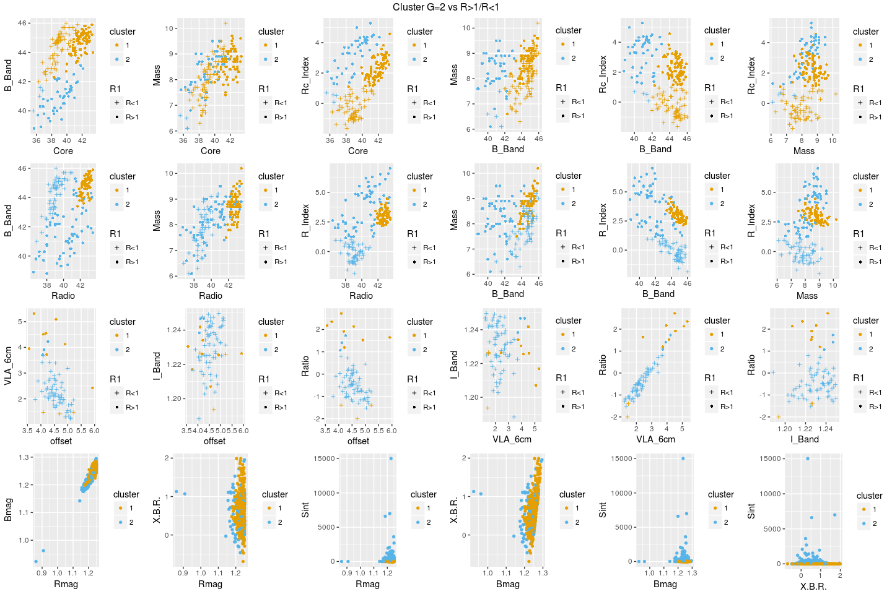
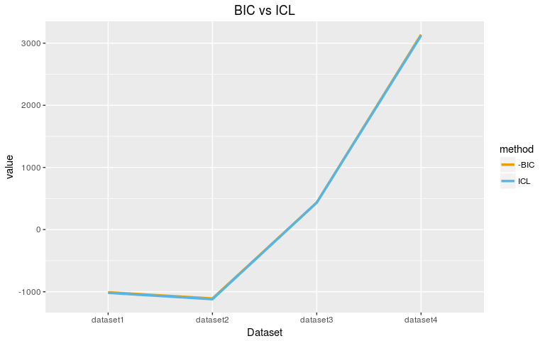
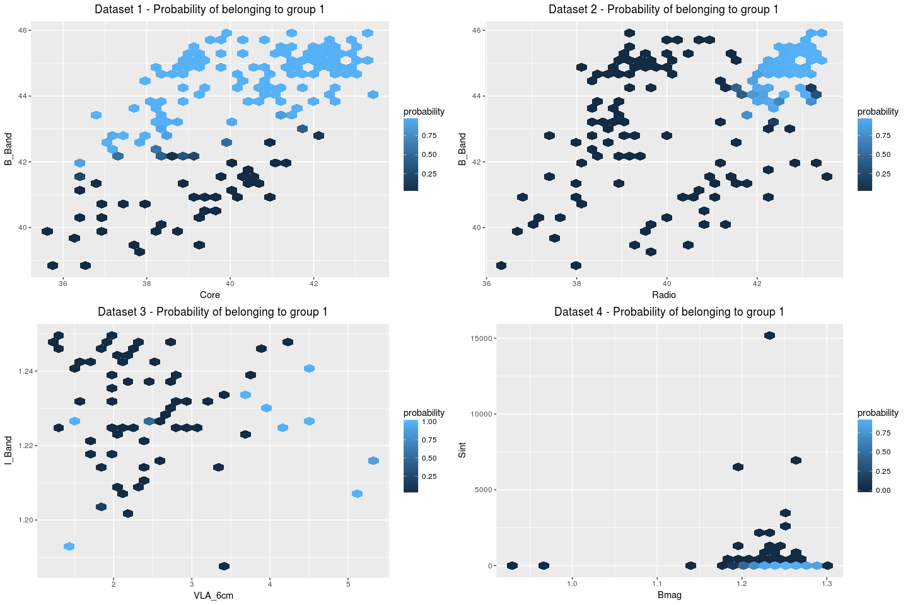
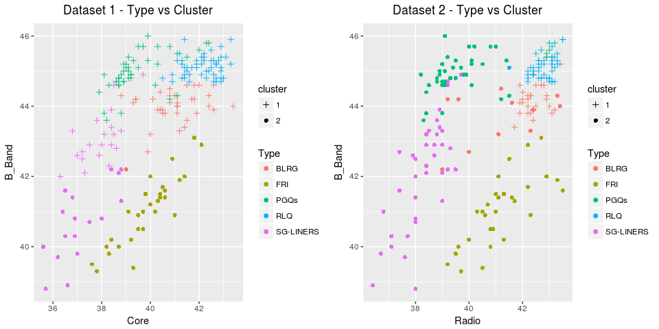

# Análise 4 - Subsídio de figuras

### Breve Resumo
Neste arquivo constam algumas figuras geradas para subsidiar a escrita do paper:

* 1 - gráficos 2 x 2 com todas as combinações de variáveis nos 4 datasets (eliminou Speak no dataset4);
* 2 - comparação BIC vs ICL dos GMM para G=2;
* 3 - plots de probabilidade de pertencimento a determinado cluster (para G=2) para variáveis ópticas vs radio;
* 4 - figuras para os datasets 1 e 2 com os tipos de galáxias e resultado da clusterização;

OBS: arquivos .PNG dos gráficos estão na mesma pasta no Github.

### 1. Gráficos 2x2

<!-- -->

### 2. Comparação BIC vs ICL

<!-- -->

### 3. Plots - Probabilidade de pertencimento a determinado cluster (para G=2)

<!-- -->

### 4. Tipos Galáxias vs resultados clustering

<!-- -->
