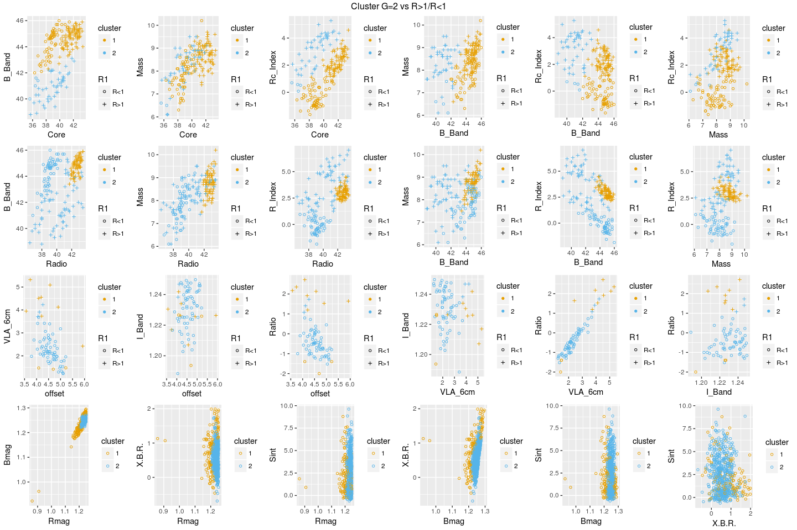
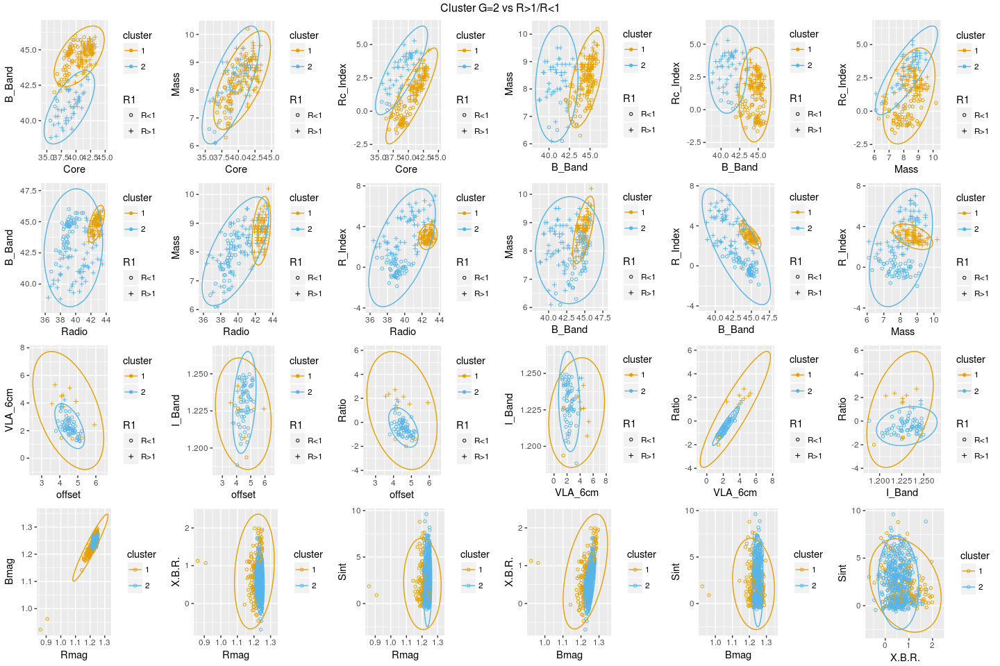
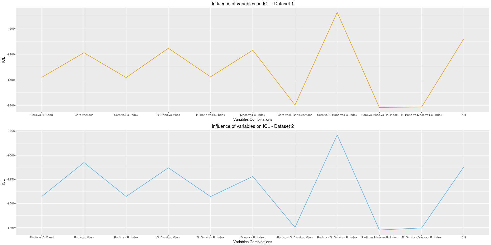
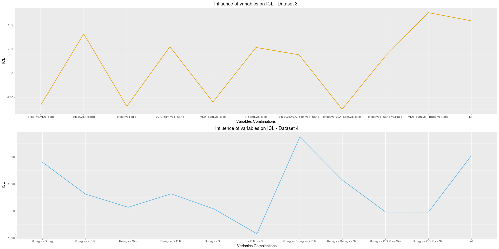
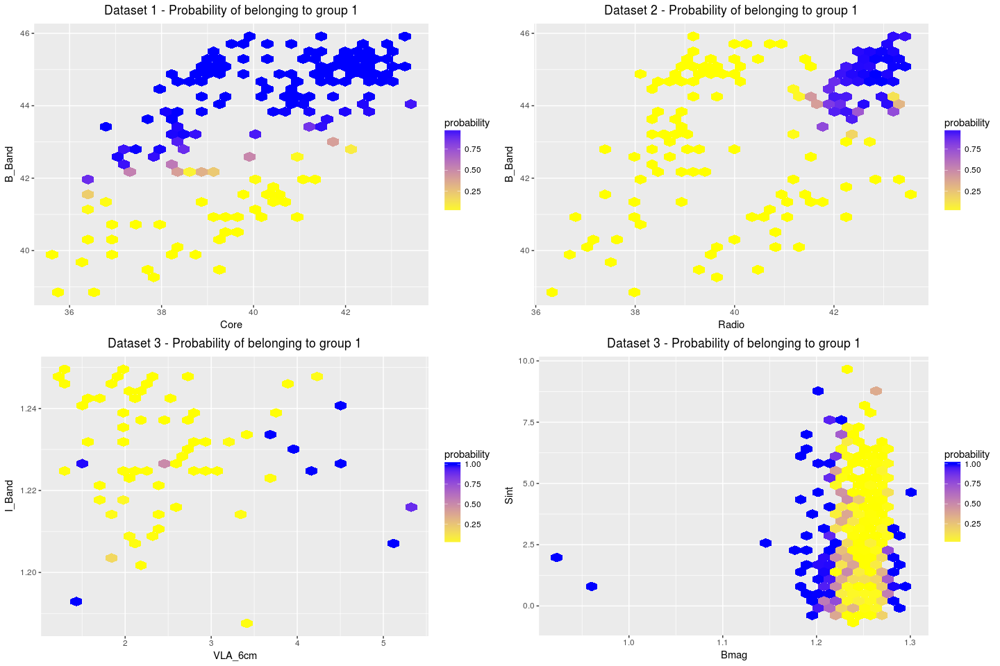
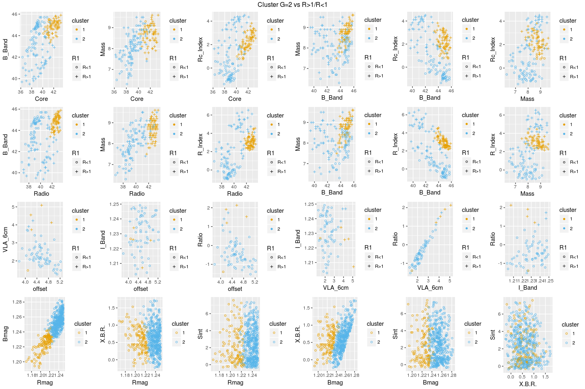
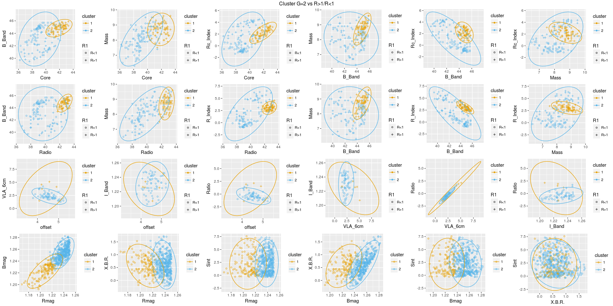
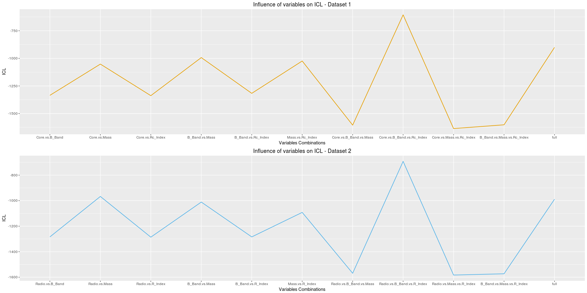
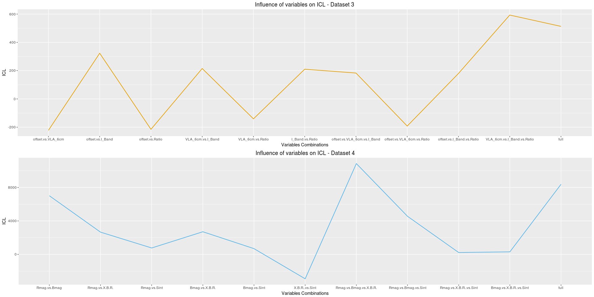
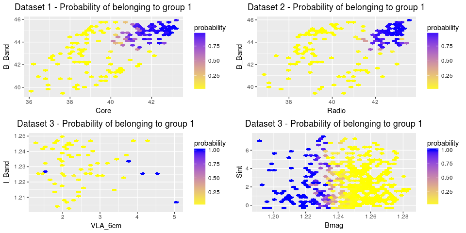

# Análise 5 - Figuras

## Parte 1 - Sem remoção dos outliers

### 1. Gráficos 2x2 SEM elipse

OBS: Os clusters foram obtidos com o pacote MClust, utilizando "semente" 1984.

<!-- -->

### 2. Gráficos 2x2 COM elipse

<!-- -->

### 3. Influência das Variáveis no valor do ICL

<!-- -->

Table: ICL - Dataset1

   ICL  id.ordered                 
------  ---------------------------
 -1471  Core.vs.B_Band             
 -1182  Core.vs.Mass               
 -1474  Core.vs.Rc_Index           
 -1129  B_Band.vs.Mass             
 -1465  B_Band.vs.Rc_Index         
 -1152  Mass.vs.Rc_Index           
 -1795  Core.vs.B_Band.vs.Mass     
  -709  Core.vs.B_Band.vs.Rc_Index 
 -1825  Core.vs.Mass.vs.Rc_Index   
 -1819  B_Band.vs.Mass.vs.Rc_Index 
 -1018  full                       

Table: ICL - Dataset2

   ICL  id.ordered                 
------  ---------------------------
 -1427  Radio.vs.B_Band            
 -1075  Radio.vs.Mass              
 -1427  Radio.vs.R_Index           
 -1129  B_Band.vs.Mass             
 -1428  B_Band.vs.R_Index          
 -1219  Mass.vs.R_Index            
 -1748  Radio.vs.B_Band.vs.Mass    
  -788  Radio.vs.B_Band.vs.R_Index 
 -1775  Radio.vs.Mass.vs.R_Index   
 -1754  B_Band.vs.Mass.vs.R_Index  
 -1120  full                       

<!-- -->

Table: ICL - Dataset3

  ICL  id.ordered                  
-----  ----------------------------
 -266  offset.vs.VLA_6cm           
  326  offset.vs.I_Band            
 -276  offset.vs.Ratio             
  219  VLA_6cm.vs.I_Band           
 -240  VLA_6cm.vs.Ratio            
  213  I_Band.vs.Ratio             
  152  offset.vs.VLA_6cm.vs.I_Band 
 -300  offset.vs.VLA_6cm.vs.Ratio  
  139  offset.vs.I_Band.vs.Ratio   
  502  VLA_6cm.vs.I_Band.vs.Ratio  
  434  full                        

Table: ICL - Dataset4

   ICL  id.ordered             
------  -----------------------
  7208  Rmag.vs.Bmag           
  2490  Rmag.vs.X.B.R.         
   525  Rmag.vs.Sint           
  2524  Bmag.vs.X.B.R.         
   277  Bmag.vs.Sint           
 -3398  X.B.R..vs.Sint         
 10931  Rmag.vs.Bmag.vs.X.B.R. 
  4525  Rmag.vs.Bmag.vs.Sint   
  -172  Rmag.vs.X.B.R..vs.Sint 
  -190  Bmag.vs.X.B.R..vs.Sint 
  8193  full                   

### 4. Probabilidade de Pertencimento a cada grupo

<!-- -->

## Parte 2 - Com remoção dos outliers

OBS: Em cada variável de cada Dataset, removeram-se as observações que ficavam abaixo do percentil 1 e acima do percentil 99.

### 1. Gráficos 2x2 SEM elipse

<!-- -->

### 2. Gráficos 2x2 COM elipse

<!-- -->

### 3. Influência das Variáveis no valor do ICL

<!-- -->

Table: ICL - Dataset1

   ICL  id.ordered                 
------  ---------------------------
 -1335  Core.vs.B_Band             
 -1052  Core.vs.Mass               
 -1338  Core.vs.Rc_Index           
  -993  B_Band.vs.Mass             
 -1317  B_Band.vs.Rc_Index         
 -1024  Mass.vs.Rc_Index           
 -1605  Core.vs.B_Band.vs.Mass     
  -606  Core.vs.B_Band.vs.Rc_Index 
 -1636  Core.vs.Mass.vs.Rc_Index   
 -1602  B_Band.vs.Mass.vs.Rc_Index 
  -901  full                       

Table: ICL - Dataset2

   ICL  id.ordered                 
------  ---------------------------
 -1284  Radio.vs.B_Band            
  -967  Radio.vs.Mass              
 -1286  Radio.vs.R_Index           
 -1011  B_Band.vs.Mass             
 -1284  B_Band.vs.R_Index          
 -1092  Mass.vs.R_Index            
 -1569  Radio.vs.B_Band.vs.Mass    
  -692  Radio.vs.B_Band.vs.R_Index 
 -1583  Radio.vs.Mass.vs.R_Index   
 -1573  B_Band.vs.Mass.vs.R_Index  
  -989  full                       

<!-- -->

Table: ICL - Dataset3

  ICL  id.ordered                  
-----  ----------------------------
 -222  offset.vs.VLA_6cm           
  323  offset.vs.I_Band            
 -215  offset.vs.Ratio             
  215  VLA_6cm.vs.I_Band           
 -141  VLA_6cm.vs.Ratio            
  210  I_Band.vs.Ratio             
  183  offset.vs.VLA_6cm.vs.I_Band 
 -192  offset.vs.VLA_6cm.vs.Ratio  
  180  offset.vs.I_Band.vs.Ratio   
  593  VLA_6cm.vs.I_Band.vs.Ratio  
  513  full                        

Table: ICL - Dataset4

   ICL  id.ordered             
------  -----------------------
  7014  Rmag.vs.Bmag           
  2661  Rmag.vs.X.B.R.         
   767  Rmag.vs.Sint           
  2707  Bmag.vs.X.B.R.         
   687  Bmag.vs.Sint           
 -2919  X.B.R..vs.Sint         
 10860  Rmag.vs.Bmag.vs.X.B.R. 
  4554  Rmag.vs.Bmag.vs.Sint   
   223  Rmag.vs.X.B.R..vs.Sint 
   305  Bmag.vs.X.B.R..vs.Sint 
  8383  full                   

### 4. Probabilidade de Pertencimento a cada grupo

<!-- -->
